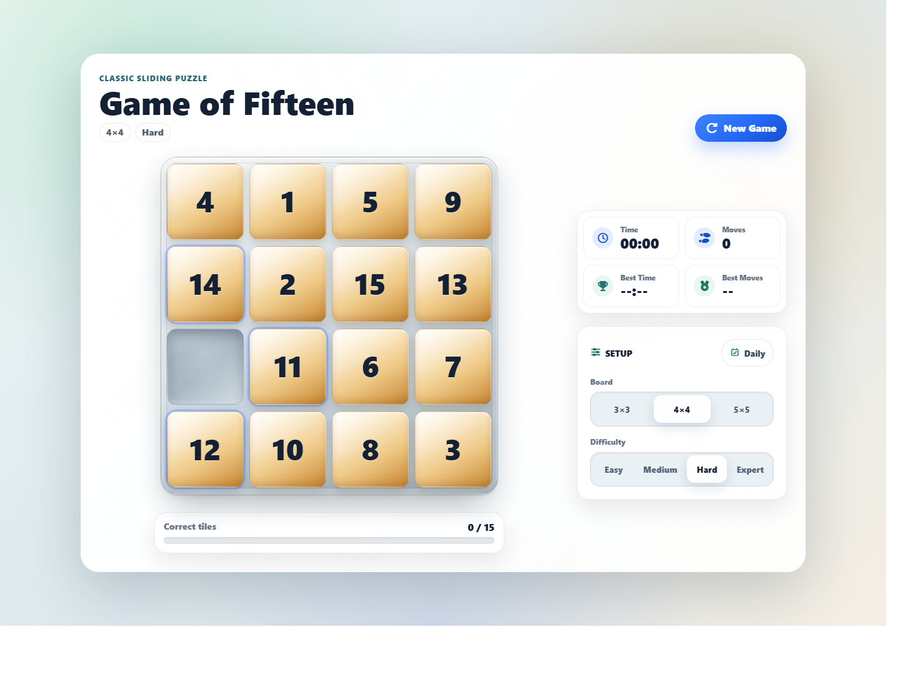
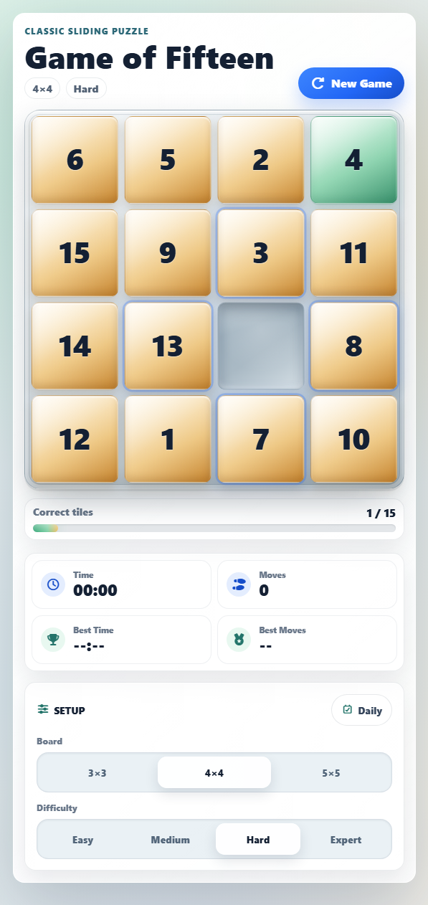

# Game of Fifteen

A polished Angular implementation of the classic sliding tile puzzle. The app generates solvable boards, tracks player progress, supports multiple board sizes and difficulty levels, and saves personal best scores in the browser.

Live demo: <https://bashar.se/projects/fifteen/>

## Screenshots





## Features

- Solvable 3x3, 4x4, and 5x5 puzzle boards.
- Difficulty settings that shuffle the board with different legal-move depths.
- Daily puzzle mode with deterministic date-based board generation.
- Move counter, first-move timer, correct-tile progress, and local best scores.
- Keyboard controls for arrow-key play.
- Click/tap controls with visual feedback for movable and invalid moves.
- Restart confirmation when a game is already in progress.
- Victory modal with final stats and share/copy support.
- Responsive layout for desktop and mobile screens.

## Tech Stack

- Angular 21 standalone components
- TypeScript
- SCSS
- Bootstrap 5
- Font Awesome
- RxJS

## Getting Started

### Requirements

- Node.js
- npm 11.x

This project uses the locked dependency versions in `package-lock.json`.

### Install

```bash
npm ci
```

If you are changing dependencies locally, use:

```bash
npm install
```

### Run Locally

```bash
npm start
```

Open `http://localhost:4200/` in your browser.

### Build

```bash
npm run build
```

The production bundle is generated in `dist/game-of-fifteen/`.

## Project Structure

```text
public/
  favicon.ico
src/
  app/
    app.component.*
    app.config.ts
    puzzle/
      puzzle.component.html
      puzzle.component.scss
      puzzle.component.ts
  index.html
  main.ts
  styles.scss
docs/
  screenshots/
```

## Implementation Notes

- Board state is stored as a flat array and rendered as positioned tiles.
- New games are generated by applying legal random moves from a solved board, which keeps the puzzle solvable.
- Correct tile count and completion state are derived from the current board.
- Best time and best move counts are stored per board size and difficulty in `localStorage`.

## License

See [LICENSE](LICENSE) for details.
